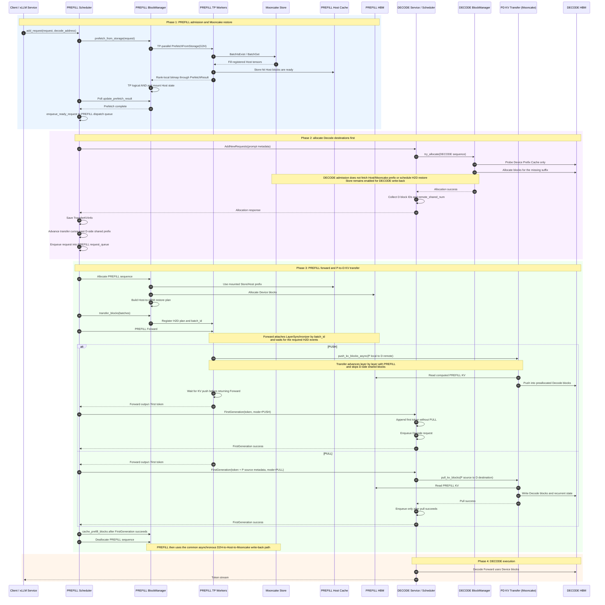

# Global Multi-Level KV Cache

## Background

Long-context inference repeatedly reads historical KV cache during autoregressive decoding. As model sizes and context windows grow, device memory capacity and bandwidth become major constraints. A device-only cache also makes a cold request recompute a prefix even when the same prefix was produced by an earlier request or another xLLM instance.

xLLM extends the device prefix cache into a three-level hierarchy:

| Tier | Purpose | Lifetime |
|---|---|---|
| Device HBM | Lowest-latency KV used by the current forward pass | Device-local |
| Host cache | Pinned CPU-memory staging and reusable host prefix cache | xLLM process |
| Mooncake Store | Distributed KV objects shared across xLLM processes and restarts | Store cluster |

A request first checks the Host prefix cache. Missing full blocks can be fetched from Mooncake Store into preallocated Host blocks, restored to HBM layer by layer, and reused without recomputing the matched prefix. Completed HBM blocks are asynchronously copied back to Host memory and then written to Mooncake Store.

The current implementation uses `HierarchyBlockManagerPool` to manage block allocation, mounting, and lifetime; `HierarchyKVCacheTransfer` to perform unified Host-to-Device and Device-to-Host transfers; and one `KVCacheStore` in each worker to access Mooncake Store. A single Store client can manage the target model, a speculative draft model, and multiple `BlockType` values from the same model.

## Architecture

The deployment can contain the following components:

- **etcd**: Registers compute instances and synchronizes service metadata.
- **xLLM Service**: Routes requests and manages fused or disaggregated Prefill/Decode instances.
- **HierarchyBlockManagerPool**: Probes the device and Host prefix caches, creates G2H, H2D, and D2H2G plans, and publishes or releases blocks after asynchronous work completes.
- **HierarchyKVCacheTransfer**: Registers target and draft cache domains, creates Host caches, and performs Host-to-Device and Device-to-Host copies.
- **KVCacheStore**: Maps each logical block to one or more Mooncake objects and performs batched existence checks, reads, and writes.
- **xLLM Worker**: Owns the device and Host KV caches, `HierarchyKVCacheTransfer`, and `KVCacheStore`, and executes inference.
- **Mooncake Store**: Provides the distributed, process-independent KV object tier.

The service-level architecture is shown below:


## Unified Cache Domains and Store Keys

`HierarchyKVCacheTransfer` supports multiple registered cache domains. Normal inference registers only the target-model domain. Speculative decoding registers the target and draft models with the same transfer instance so they share one Host-transfer layout and one `KVCacheStore`:

| Cache domain | `CacheRole` | Store `key_component` |
|---|---|---|
| Target model | `TARGET` | Fixed to `main` |
| Embedded draft | `DRAFT` | `spec_draft::<algorithm>::embedded` |
| Separate draft model | `DRAFT` | `spec_draft::<algorithm>::<directory-name>::<normalized-path-digest>` |

During initialization, the Store builds an index by `BlockType`. Every cache domain that supports that `BlockType` produces a separate physical object. For example, when both the target and draft models contain `BlockType::KV`, one logical KV block maps to two Store objects. If a `BlockType` exists only in the target model, only the target object is generated.

The current object-key namespace is `xllm-kv-v3`. Conceptually, a key contains the following fields:

```text
Non-MLA: xllm-kv-v3 + model_id + key_component + tp_size
                      + block_type + tp_rank + schema_hash + block_hash

MLA:     xllm-kv-v3 + model_id + key_component + mla
                      + block_type + schema_hash + block_hash
```

- `model_id` is the target-model namespace and is included in both target and draft objects.
- `key_component` separates the target model, speculative algorithm, and draft-model source.
- Non-MLA caches use `tp_size`, `tp_rank`, and `block_type` to isolate different parallel topologies, ranks, and cache types.
- MLA KV cache is replicated across ranks, so its object key uses a fixed `mla` marker and contains neither `tp_size` nor `tp_rank`. Every rank reads through the same object key, while only TP rank 0 writes to Mooncake Store.
- `schema_hash` is derived from each tensor's role, dtype, and per-block shape, excluding the number of Host blocks. Changing only `host_blocks_factor` therefore does not change object keys, while a cache-layout change automatically selects a new key space.
- `block_hash` is the 128-bit content hash of the corresponding token block.

The Store API exposes logical blocks to its caller and expands them into physical cache-domain requests internally. A worker reports a hit only when **all physical objects** for that logical block exist and are read successfully. `PrefetchResult` then applies a logical AND across all TP ranks. A Store hit is publishable only when it is complete across both cache domains and TP ranks.

## Block Lifecycle

Fused instances and the Prefill side of disaggregated PD use the complete Mooncake admission, Host restore, and write-back path. Decode keeps Store enabled for its Host/Mooncake write-back path, while its request-admission path remains Device-prefix-only. With speculative decoding enabled, each logical block operation in the following diagram covers every target or draft cache domain that supports its `BlockType`.

```mermaid
sequenceDiagram
    autonumber

    participant Client as Client / xLLM Service
    participant Scheduler as Scheduler
    participant BlockMgr as HierarchyBlockManagerPool
    participant Engine as Engine / RemoteWorker
    participant Result as PrefetchResult / Async Callback
    participant Worker as TP Workers
    participant Store as Mooncake Store
    participant Host as Host Cache
    participant HBM as Device HBM

    rect rgb(235, 245, 255)
        Note over Client,Store: Phase 1: request admission and Mooncake prefetch

        Client->>Scheduler: add_request(request)
        Scheduler->>BlockMgr: prefetch_from_storage(request)
        BlockMgr->>Host: Probe Host Prefix Cache
        Host-->>BlockMgr: Existing blocks and holes
        BlockMgr->>Host: Allocate G2H destinations for holes
        Host-->>BlockMgr: Host block IDs

        Note over BlockMgr,Store: If Host already covers the prefix, Store RPCs are skipped
        BlockMgr->>Engine: prefetch_from_storage(G2H infos)
        Engine->>Result: Create worker-by-block result matrix

        par All TP ranks
            Engine->>Worker: PrefetchFromStorage(G2H batch)
            Worker->>Worker: Expand each BlockType into cache-domain objects
            Worker->>Store: BatchIsExist(all physical keys)
            Store-->>Worker: Physical-existence bitmap
            opt All physical objects for a logical block exist
                Worker->>Store: BatchGet(all component keys, Host tensors)
                Store-->>Worker: Fill each domain's Host tensors
            end
            Worker->>Worker: Aggregate a rank-local logical bitmap
            Worker-->>Result: Logical bitmap and completion
        end

        loop Admission polling
            Scheduler->>BlockMgr: update_prefetch_result(timeout)
            BlockMgr->>Result: completed()?
        end
        BlockMgr->>Result: merged_hits()
        Result-->>BlockMgr: Logical AND across all TP ranks
        Note right of Result: Every cache domain must hit within one rank<br/>then all TP ranks are ANDed

        BlockMgr->>Host: Release Store-miss destinations
        BlockMgr->>Host: Cache Store-hit blocks
        BlockMgr->>BlockMgr: Compute reachable prefix and mount Host state
        BlockMgr-->>Scheduler: Prefetch complete
        Scheduler->>Scheduler: AdmissionReady / enqueue_ready_request
        Note over Scheduler,Result: Workers do not directly callback the Scheduler
    end

    rect rgb(240, 255, 240)
        Note over Scheduler,HBM: Phase 2: Host-to-HBM restore and forward

        Scheduler->>BlockMgr: allocate(sequence, num_tokens)
        BlockMgr->>BlockMgr: Merge Device and mounted Host prefixes
        BlockMgr->>HBM: Allocate missing Device blocks
        HBM-->>BlockMgr: Device block IDs
        BlockMgr->>Host: Best-effort allocate future D2H destinations
        Host-->>BlockMgr: Reserved Host block IDs
        BlockMgr->>BlockMgr: Publish Device Prefix metadata
        Note over BlockMgr,HBM: Metadata publication is token-cursor bounded but precedes physical H2D completion
        BlockMgr->>BlockMgr: Build layer-wise H2D plan

        Scheduler->>BlockMgr: transfer_blocks(batches)
        BlockMgr->>Engine: Enqueue TransferBlocks(H2D, batch_id)
        BlockMgr-->>Scheduler: Return after dispatch, without waiting for H2D completion

        par All TP ranks
            Engine->>Worker: Register H2D transfer
            Worker->>Worker: Create LayerSynchronizer(batch_id)
            Worker->>Worker: Schedule load_from_host asynchronously
            Worker-->>Engine: Registration ACK with scheduled block count
            Engine->>Worker: Forward(batch_id), ordered after registration
            Worker->>Worker: Attach LayerSynchronizer(batch_id)
            Note right of Worker: Speculative target/draft mappings share<br/>the same batch and synchronizer

            loop Each layer-copy range
                Worker->>Host: Read Host KV tensors
                Host-->>Worker: Host KV
                Worker->>HBM: Async H2D copy and record event
                Worker->>Worker: Current compute layer waits for event
                Worker->>HBM: Read KV after the event completes
            end

            Worker-->>Engine: Forward output
        end

        Note over Scheduler,Worker: There is no H2D-complete callback to the Scheduler
    end

    rect rgb(255, 245, 235)
        Note over Scheduler,Store: Phase 3: HBM-to-Host-to-Mooncake write-back

        Scheduler->>BlockMgr: deallocate(completed sequence)
        BlockMgr->>BlockMgr: Publish completed Device Prefix metadata
        BlockMgr->>BlockMgr: Collect HBM to reserved-Host block pairs
        BlockMgr->>BlockMgr: Reset sequence while offload pairs retain block references

        Scheduler->>BlockMgr: transfer_offload_blocks()
        BlockMgr->>Engine: Submit asynchronous D2H2G plans

        par All TP ranks
            Engine->>Worker: TransferKvBlocks(D2H2G)
            Worker->>Worker: Copy stream waits for compute stream
            Worker->>HBM: Read Device KV
            HBM-->>Worker: Device KV
            Worker->>Host: D2H copy for each cache domain and synchronize stream
            Worker->>Worker: Expand physical objects and deduplicate by key
            opt Non-MLA or MLA TP rank 0
                Worker->>Store: BatchIsExist(unique keys)

                alt Store key is absent
                    Worker->>Store: BatchPut(missing keys, Host tensors)
                    Store-->>Worker: Put results
                else Store key already exists
                    Worker->>Worker: Skip overwrite and count it as present
                end
            end

            Note right of Worker: Non-zero MLA ranks skip Store writes
            Worker->>Worker: Logical put succeeds only if all physical objects succeed
            Note right of Worker: Partial BatchPut failure is logged only<br/>and does not change D2H success
            Worker-->>Engine: Full block count when D2H succeeds
        end

        Engine-->>Result: TP futures
        Result->>Result: Validate every TP result against the expected block count
        Result-->>BlockMgr: Future callback(copy_ok)
        BlockMgr->>HBM: Always release offload-held Device blocks

        alt D2H succeeds on every TP rank
            BlockMgr->>Host: Publish Host Prefix Cache
        else D2H fails on any TP rank
            BlockMgr->>Host: Publish nothing and release reserved Host blocks
        end

        Note over Scheduler,Result: Offload completion is handled by the BlockManager callback, not the Scheduler
    end
```



## Speculative-Decoding Cache

When speculative decoding and the Host cache are enabled, `SpeculativeWorkerImpl` makes the target and draft workers reuse one `HierarchyKVCacheTransfer`. Both cache domains must share the same producer stream. After registration is finalized, xLLM creates their Host caches, Host-transfer implementation, and `KVCacheStore` together.

The unified cache domains have the following behavior:

- G2H prefetch reads both target and draft objects. If any object is missing, the logical block is treated as a miss so xLLM never restores an incomplete draft state.
- H2D and D2H requests create separate `target_mappings` and `draft_mappings`, but advance under the same `batch_id` and layer synchronizer.
- D2H2G write-back first copies both cache domains into their Host caches, then writes each domain through the same `KVCacheStore` into its own key space.
- Draft keys automatically include the speculative algorithm and draft source. Changing the draft path selects new keys. If weights are replaced in place at the same path, change `model_id` as well.

Normal non-speculative inference still registers only the `main` cache domain and retains the previous single-domain behavior.

## Disaggregated PD

In disaggregated PD, Mooncake Store admission and Host-to-HBM restore run on the **Prefill** instance. The Decode instance allocates destination Device blocks before Prefill starts and only probes its Device Prefix Cache during admission; it does not mount Host aliases, fetch a prefix from Mooncake, or schedule Host-to-Device restoration. Decode still enables Store and Host cache capacity for its write-back path.



The scheduler supports both `PUSH` and `PULL` through `kv_cache_transfer_mode`. The current code no longer provides a `kv_cache_transfer_type` option. Enable the global Mooncake Store tier on both Prefill and Decode, using disjoint `store_local_hostname` base-port ranges.

## Deployment

### Prerequisites

- Build and install [xLLM](/en/getting_started/quick_start/).
- Install [xLLM Service](https://github.com/xLLM-AI/xllm-service) when service routing or disaggregated PD is required.
- Build or install the Mooncake Store `mooncake_master` and `mooncake_client` binaries.
- Reserve enough Host memory. Mooncake Store requires `--enable_prefix_cache=true` and `--host_blocks_factor > 1`.

For Mooncake's etcd-backed high availability mode, install Go first and explicitly enable the HA backends when building xLLM and the bundled Mooncake binaries:

```bash
MAX_JOBS=32 SKIP_EXPORT=1 \
  python setup.py build --device npu --enable-ha true
cmake --build build/cmake.linux-aarch64-cpython-311 \
  --target mooncake_master mooncake_client -j32
```

Ready-to-use HA master, independent Store client, and xLLM argument scripts are available under `scripts/kvcache_store/`.

### Start a Minimal Mooncake Store

The following TCP example uses Mooncake's P2P handshake, so no separate Transfer Engine metadata service is required:

```bash
export MC_STORE_CLUSTER_ID=xllm-mooncake

mooncake_master \
  --rpc_address=0.0.0.0 \
  --rpc_port=50051
```

Start at least one resource-owning Store client:

```bash
mooncake_client \
  --host=0.0.0.0:50053 \
  --port=50052 \
  --global_segment_size=4GB \
  --master_server_address=127.0.0.1:50051 \
  --metadata_server=P2PHANDSHAKE \
  --protocol=tcp
```

### Start a High-Availability Mooncake Store Cluster

First start an etcd cluster reachable by every Mooncake master. Then start one master instance on each master node. All instances use the same etcd endpoints and `cluster_id`, while `rpc_address` must identify the reachable address of that specific instance:

```bash
mooncake_master \
  --enable_ha=true \
  --ha_backend_type=etcd \
  --ha_backend_connstring="10.0.0.1:2379;10.0.0.2:2379;10.0.0.3:2379" \
  --cluster_id=xllm-mooncake \
  --rpc_address=10.0.1.11 \
  --rpc_port=50051
```

Store clients and xLLM use etcd to discover and follow the current leader instead of binding to one master address:

```bash
export MC_STORE_CLUSTER_ID=xllm-mooncake
MOONCAKE_HA_ENTRY='etcd://10.0.0.1:2379;10.0.0.2:2379;10.0.0.3:2379'

mooncake_client \
  --host=0.0.0.0:50053 \
  --port=50052 \
  --global_segment_size=4GB \
  --master_server_address="${MOONCAKE_HA_ENTRY}" \
  --metadata_server=P2PHANDSHAKE \
  --protocol=tcp

/path/to/xllm \
  --enable_prefix_cache=true \
  --host_blocks_factor=4 \
  --enable_kvcache_store=true \
  --store_protocol=tcp \
  --store_master_server_address="${MOONCAKE_HA_ENTRY}" \
  --store_metadata_server=P2PHANDSHAKE \
  --store_local_hostname=127.0.0.1:12345
```

The `etcd://` prefix in `store_master_server_address` selects the HA leader-discovery backend. Do not add `http://` to the endpoint list after that prefix. When using a custom `cluster_id`, every Mooncake master, Store client, and xLLM process must use the same `MC_STORE_CLUSTER_ID`.

### Start etcd and xLLM Service

This step is required for service routing and disaggregated PD, but not for a standalone fused xLLM process:

```bash
./etcd \
  --listen-peer-urls=http://0.0.0.0:10999 \
  --listen-client-urls=http://0.0.0.0:10998
```

```bash
./xllm_master_serving \
  --etcd_addr=127.0.0.1:10998 \
  --http_server_port=28888 \
  --rpc_server_port=28889 \
  --tokenizer_path=/path/to/tokenizer_config_dir/
```

### Fused xLLM Example

```bash
/path/to/xllm \
  --model=/path/to/model \
  --model_id=my-model-revision-v1 \
  --enable_prefix_cache=true \
  --host_blocks_factor=4 \
  --enable_kvcache_store=true \
  --store_protocol=tcp \
  --store_master_server_address=127.0.0.1:50051 \
  --store_metadata_server=P2PHANDSHAKE \
  --store_local_hostname=127.0.0.1:12345 \
  --prefetch_batch_size=8 \
  --prefetch_timeout=30000
```

`store_local_hostname` is a base Transfer Engine endpoint. Each worker uses `base_port + worker_rank`, so the entire port range must be free and reachable.

For RDMA, set `--store_protocol=rdma`. Use `--store_rdma_devices=mlx5_0,mlx5_1` to select HCAs for the Store client embedded in each xLLM Worker, or leave it empty for Mooncake auto-discovery. Initialization failures remain RDMA failures and never fall back to TCP. xLLM does not read `DEVICE_NAMES`; the standalone `mooncake_client` uses its own `--device_names` option.

Speculative decoding does not require a separate draft Store namespace. xLLM automatically generates a distinct `key_component` for the draft cache. If `--model_id` is omitted, xLLM uses the final component of the model path; production deployments should still provide a stable `--model_id` that identifies the model version.

### Disaggregated PD Example

Use the normal [Disaggregated PD](/en/features/disagg_pd/) flags and enable Store on both roles. Use different `store_local_hostname` base ports for Prefill and Decode:

```bash
/path/to/xllm \
  --enable_disagg_pd=true \
  --instance_role=PREFILL \
  --kv_cache_transfer_mode=PUSH \
  --enable_prefix_cache=true \
  --host_blocks_factor=4 \
  --enable_kvcache_store=true \
  --store_protocol=tcp \
  --store_master_server_address=127.0.0.1:50051 \
  --store_metadata_server=P2PHANDSHAKE \
  --store_local_hostname=127.0.0.1:12345
```

Enable Store on Decode with a different local endpoint range:

```bash
/path/to/xllm \
  --enable_disagg_pd=true \
  --instance_role=DECODE \
  --kv_cache_transfer_mode=PUSH \
  --enable_prefix_cache=true \
  --host_blocks_factor=4 \
  --enable_kvcache_store=true \
  --store_protocol=tcp \
  --store_master_server_address=127.0.0.1:50051 \
  --store_metadata_server=P2PHANDSHAKE \
  --store_local_hostname=127.0.0.1:13345
```

See the [CLI Reference](/en/cli_reference/) for all `KVCacheStoreConfig` parameters.

## Correctness and Operational Notes

- Store hits use two levels of completeness checks: each worker must successfully read every registered cache domain for the `BlockType`, and every TP rank must then report a hit before the block is mounted into the Host Prefix Cache.
- `prefetch_timeout` stops issuing new prefetch batches after the timeout, but admission still waits for every in-flight TP batch to finish. `0` waits indefinitely.
- H2D registration does not wait for the physical copy. Forward attaches a `LayerSynchronizer` using `batch_id` and waits at the corresponding layers. The Scheduler receives no H2D-complete callback.
- Host Prefix publication depends only on successful D2H completion from every TP rank. Mooncake `BatchPut` is best-effort; a partial Store write failure is logged but does not invalidate an already successful Host copy.
- `BatchPut` first deduplicates object keys and calls `BatchIsExist`. Existing objects are never overwritten, and duplicate objects in one batch are written only once. A logical block counts as a Store success only when every cache-domain object already exists or is written successfully.
- The current Store key version is `xllm-kv-v3`. Host-block capacity is excluded from `schema_hash`, while tensor role, dtype, per-block shape, TP topology, `BlockType`, and cache-domain identity isolate the key space.
- Weight contents are not automatically encoded in object keys. Use a new `model_id` whenever target or draft weights, quantization, or any other setting that can change KV values is updated, and rotate or clean the old Store namespace as needed.
- In PD, Prefill and Decode both enable Store. They must use disjoint `store_local_hostname` base-port ranges because both roles reuse worker ranks and each worker binds `base_port + worker_rank`.
