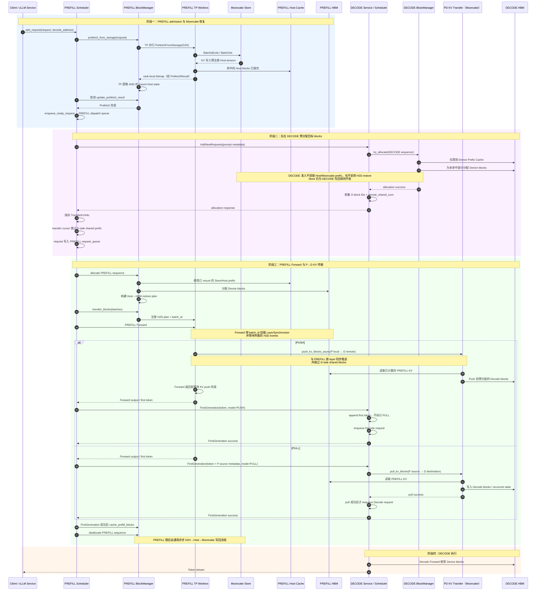

# 全局多级 KV Cache

## 背景

长上下文推理在自回归解码过程中需要持续读取历史 KV Cache。随着模型规模和上下文窗口增长，设备显存容量和带宽会成为主要瓶颈。仅使用 Device Cache 时，即使相同前缀已经被其他请求或其他 xLLM 实例计算过，冷请求仍然需要重新执行 Prefill。

xLLM 将 Device Prefix Cache 扩展为三级缓存：

| 层级 | 用途 | 生命周期 |
|---|---|---|
| Device HBM | 当前 Forward 使用的最低延迟 KV | 设备本地 |
| Host Cache | Pinned CPU 内存中的传输缓冲区和可复用 Host Prefix Cache | xLLM 进程 |
| Mooncake Store | 在多个 xLLM 进程以及进程重启之间共享的分布式 KV 对象 | Store 集群 |

请求首先探测 Host Prefix Cache。缺失的完整 Block 可以从 Mooncake Store 读取到预分配的 Host Block，再按层恢复到 HBM，从而跳过已命中前缀的重复计算。已完成的 HBM Block 会异步写回 Host，随后写入 Mooncake Store。

当前实现由 `HierarchyBlockManagerPool` 管理 Block 的分配、挂载和生命周期，由 `HierarchyKVCacheTransfer` 统一执行 Host↔Device 传输，并由每个 Worker 内的一个 `KVCacheStore` 访问 Mooncake Store。一个 Store 客户端可以同时管理主模型、投机解码 Draft 模型以及同一模型中的多种 `BlockType`。

## 架构

部署中可以包含以下组件：

- **etcd**：注册计算实例并同步服务元数据。
- **xLLM Service**：路由请求并管理 Fused 或 PD 分离实例。
- **HierarchyBlockManagerPool**：探测 Device/Host Prefix Cache，生成 G2H、H2D 和 D2H2G 计划，并在异步任务完成后发布或释放 Block。
- **HierarchyKVCacheTransfer**：统一注册主模型与 Draft 模型缓存域，创建 Host Cache，并执行 Host↔Device 拷贝。
- **KVCacheStore**：将逻辑 Block 映射为一个或多个 Mooncake 对象，执行批量存在性检查、读取和写入。
- **xLLM Worker**：持有 Device/Host KV Cache、`HierarchyKVCacheTransfer` 和 `KVCacheStore`，并执行推理。
- **Mooncake Store**：提供分布式、可跨进程复用的 KV 对象存储层。

服务级整体架构如下：


## 统一缓存域与 Store 键

`HierarchyKVCacheTransfer` 支持注册多个缓存域。普通推理只注册主模型缓存域；投机解码会把主模型和 Draft 模型注册到同一个 Transfer 实例，并共享同一个 Host 传输布局与 `KVCacheStore`：

| 缓存域 | `CacheRole` | Store `key_component` |
|---|---|---|
| 主模型 | `TARGET` | 固定为 `main` |
| 内置 Draft | `DRAFT` | `spec_draft::<algorithm>::embedded` |
| 独立 Draft 模型 | `DRAFT` | `spec_draft::<algorithm>::<目录名>::<规范化路径摘要>` |

Store 初始化时会按 `BlockType` 构建索引。每个支持该 `BlockType` 的缓存域都会形成一个独立物理对象。例如，主模型和 Draft 模型都包含 `BlockType::KV` 时，一个逻辑 KV Block 会对应两个 Store 对象；若某个 `BlockType` 只存在于主模型，则只生成主模型对象。

当前对象键使用 `xllm-kv-v3` 命名空间。概念上由以下字段组成：

```text
非 MLA：xllm-kv-v3 + model_id + key_component + tp_size
                   + block_type + tp_rank + schema_hash + block_hash

MLA：   xllm-kv-v3 + model_id + key_component + mla
                   + block_type + schema_hash + block_hash
```

- `model_id` 是主模型命名空间，主模型和 Draft 模型对象都会包含它。
- `key_component` 区分主模型、投机算法和 Draft 模型来源。
- 非 MLA 缓存使用 `tp_size`、`tp_rank` 和 `block_type` 隔离不同并行拓扑、Rank 和缓存类型。
- MLA KV Cache 在 Rank 间复制，因此对象键使用固定的 `mla` 标识，不包含 `tp_size` 或 `tp_rank`。所有 Rank 使用相同的对象键读取缓存，只有 TP Rank 0 写入 Mooncake Store。
- `schema_hash` 由单个 Block 内各 Tensor 的 role、dtype 和除 Host Block 数量之外的 shape 生成。因此只调整 `host_blocks_factor` 不会改变对象键，但缓存布局变化会自动进入新的键空间。
- `block_hash` 是对应 Token Block 的 128 位内容哈希。

Store API 以“逻辑 Block”为上层接口，以“缓存域对象”为物理请求。只有同一 Worker 内该逻辑 Block 对应的**全部物理对象**都存在且读取成功，该 Worker 才会报告命中；随后 `PrefetchResult` 还会对所有 TP Rank 的结果执行逻辑 AND。也就是说，最终可发布的 Store 命中必须同时满足“所有缓存域完整”和“所有 TP Rank 完整”。

## Block 流转

Fused 实例和 PD 分离中的 Prefill 实例使用完整的 Mooncake 准入、Host 恢复和写回流程。Decode 也保持 Store 开启，用于自身的 Host/Mooncake 写回；但 Decode 的请求准入仍然只探测 Device Prefix。启用投机解码时，下图中的一次逻辑 Block 操作会同时覆盖主模型和 Draft 模型中支持该 `BlockType` 的缓存域。

```mermaid
sequenceDiagram
    autonumber

    participant Client as Client / xLLM Service
    participant Scheduler as Scheduler
    participant BlockMgr as HierarchyBlockManagerPool
    participant Engine as Engine / RemoteWorker
    participant Result as PrefetchResult / Async Callback
    participant Worker as TP Workers
    participant Store as Mooncake Store
    participant Host as Host Cache
    participant HBM as Device HBM

    rect rgb(235, 245, 255)
        Note over Client,Store: 阶段一：请求准入与 Mooncake Store 预取

        Client->>Scheduler: add_request(request)
        Scheduler->>BlockMgr: prefetch_from_storage(request)
        BlockMgr->>Host: 探测 Host Prefix Cache
        Host-->>BlockMgr: 返回已有 blocks 与 holes
        BlockMgr->>Host: 为 holes 分配 G2H 目标 blocks
        Host-->>BlockMgr: 返回 Host block IDs

        Note over BlockMgr,Store: 若 Host 已覆盖全部 prefix，则跳过 Store RPC
        BlockMgr->>Engine: prefetch_from_storage(G2H infos)
        Engine->>Result: 创建 worker_count × block_count 结果矩阵

        par 所有 TP Rank 并行
            Engine->>Worker: PrefetchFromStorage(G2H batch)
            Worker->>Worker: 按 BlockType 展开各缓存域物理对象
            Worker->>Store: BatchIsExist(all physical keys)
            Store-->>Worker: physical existence bitmap
            opt 同一逻辑 Block 的全部物理对象都存在
                Worker->>Store: BatchGet(all component keys, Host tensors)
                Store-->>Worker: 各缓存域 KV 写入对应 Host tensors
            end
            Worker->>Worker: 聚合为 rank-local logical bitmap
            Worker-->>Result: logical bitmap 与完成状态
        end

        loop Scheduler admission poll
            Scheduler->>BlockMgr: update_prefetch_result(timeout)
            BlockMgr->>Result: completed()?
        end
        BlockMgr->>Result: merged_hits()
        Result-->>BlockMgr: 所有 TP bitmap 逻辑 AND
        Note right of Result: 单 Rank 内要求全部缓存域命中<br/>跨 Rank 再执行逻辑 AND

        BlockMgr->>Host: 释放 Store miss 的目标 blocks
        BlockMgr->>Host: cache Store hit blocks
        BlockMgr->>BlockMgr: 计算连续可用 prefix 并 mount Host state
        BlockMgr-->>Scheduler: Prefetch 完成
        Scheduler->>Scheduler: AdmissionReady / enqueue_ready_request
        Note over Scheduler,Result: Worker 不直接回调 Scheduler
    end

    rect rgb(240, 255, 240)
        Note over Scheduler,HBM: 阶段二：Host KV 恢复到 HBM 并执行 Forward

        Scheduler->>BlockMgr: allocate(sequence, num_tokens)
        BlockMgr->>BlockMgr: 合并 Device Prefix 与已 mount 的 Host Prefix
        BlockMgr->>HBM: 分配缺失的 Device blocks
        HBM-->>BlockMgr: 返回 Device block IDs
        BlockMgr->>Host: best-effort 分配后续 D2H 目标 blocks
        Host-->>BlockMgr: 返回预留 Host block IDs
        BlockMgr->>BlockMgr: 发布 Device Prefix 元数据
        Note over BlockMgr,HBM: 元数据发布受 token cursor 限制，但发生在物理 H2D 完成之前
        BlockMgr->>BlockMgr: 构建按层 H2D plan

        Scheduler->>BlockMgr: transfer_blocks(batches)
        BlockMgr->>Engine: enqueue TransferBlocks(H2D, batch_id)
        BlockMgr-->>Scheduler: 调度返回，不等待 H2D copy 完成

        par 所有 TP Rank 并行
            Engine->>Worker: 注册 H2D transfer
            Worker->>Worker: 创建 LayerSynchronizer(batch_id)
            Worker->>Worker: 异步调度 load_from_host
            Worker-->>Engine: registration ACK 与 scheduled block 数
            Engine->>Worker: Forward(batch_id)，排在注册 RPC 之后
            Worker->>Worker: 挂载 LayerSynchronizer(batch_id)
            Note right of Worker: 投机解码的 target/draft mappings<br/>共享同一批次与同步器

            loop 每个 layer copy range
                Worker->>Host: 读取 Host KV tensors
                Host-->>Worker: Host KV
                Worker->>HBM: 异步 H2D copy 并记录 event
                Worker->>Worker: 当前计算层等待 event
                Worker->>HBM: event 完成后读取 KV Cache
            end

            Worker-->>Engine: Forward output
        end

        Note over Scheduler,Worker: 不存在 H2D-complete 回调 Scheduler
    end

    rect rgb(255, 245, 235)
        Note over Scheduler,Store: 阶段三：HBM Block 写回 Host 与 Mooncake

        Scheduler->>BlockMgr: deallocate(completed sequence)
        BlockMgr->>BlockMgr: 发布已完成的 Device Prefix 元数据
        BlockMgr->>BlockMgr: 收集 HBM → 已预留 Host block pairs
        BlockMgr->>BlockMgr: reset sequence，offload pair 保留 block 引用

        Scheduler->>BlockMgr: transfer_offload_blocks()
        BlockMgr->>Engine: 异步提交 D2H2G plans

        par 所有 TP Rank 并行
            Engine->>Worker: TransferKvBlocks(D2H2G)
            Worker->>Worker: copy stream wait_stream(compute stream)
            Worker->>HBM: 读取 Device KV
            HBM-->>Worker: Device KV
            Worker->>Host: 各缓存域 D2H copy 并同步 copy stream
            Worker->>Worker: 展开物理对象并按 key 去重
            opt 非 MLA 或 MLA TP Rank 0
                Worker->>Store: BatchIsExist(unique keys)

                alt Store key 不存在
                    Worker->>Store: BatchPut(missing keys, Host tensors)
                    Store-->>Worker: Put results
                else Store key 已存在
                    Worker->>Worker: 跳过覆盖并计为已存在
                end
            end

            Note right of Worker: MLA 非 0 Rank 跳过 Store 写入
            Worker->>Worker: 全部物理对象成功才记为 logical put success
            Note right of Worker: BatchPut 部分失败只记录日志<br/>不会改变 D2H 成功状态
            Worker-->>Engine: D2H 成功时返回完整 block count
        end

        Engine-->>Result: 所有 TP futures
        Result->>Result: 校验每个 TP 返回 expected block count
        Result-->>BlockMgr: future callback(copy_ok)
        BlockMgr->>HBM: 无论 copy_ok 与否都释放 offload 持有的 Device blocks

        alt 所有 TP Rank 的 D2H 都成功
            BlockMgr->>Host: 发布 Host Prefix Cache
        else 任一 TP Rank D2H 失败
            BlockMgr->>Host: 不发布 Host Prefix，并释放预留 Host blocks
        end

        Note over Scheduler,Result: offload completion 由 BlockManager callback 处理，不回调 Scheduler
    end
```



## 投机解码缓存

启用投机解码并配置 Host Cache 时，`SpeculativeWorkerImpl` 会让 Target Worker 和 Draft Worker 复用同一个 `HierarchyKVCacheTransfer`。两个缓存域必须共享同一条 producer stream，注册完成后再统一创建 Host Cache、Host 传输器和 `KVCacheStore`。

统一缓存域带来以下行为：

- G2H 预取会同时读取主模型和 Draft 模型对象。任一对象缺失时，该逻辑 Block 都按 miss 处理，避免只恢复主模型而让 Draft 状态不完整。
- H2D 和 D2H 请求会分别生成 `target_mappings` 与 `draft_mappings`，但在同一 `batch_id` 和 Layer Synchronizer 下推进。
- D2H2G 写回会先把两个缓存域复制到各自 Host Cache，再由同一个 `KVCacheStore` 写入各自键空间。
- Draft 键自动包含投机算法和 Draft 来源。更换 Draft 路径会产生新键；若在原路径原地替换权重，应同时更换 `model_id`。

普通非投机推理仍只注册 `main` 缓存域，行为与此前单域 Store 一致。

## PD 分离

在 PD 分离场景中，Mooncake Store 准入和 Host→HBM 恢复发生在 **Prefill** 实例。Decode 会在 Prefill 开始前预分配目标 Device Block，并且在请求准入时只探测 Device Prefix Cache；Decode 不会 mount Host alias、从 Mooncake 获取 prefix 或调度 Host→Device 恢复。Decode 仍需开启 Store 并配置 Host Cache 容量，用于自身的写回流程。



调度路径通过 `kv_cache_transfer_mode` 支持 `PUSH` 和 `PULL`。当前代码不再提供 `kv_cache_transfer_type` 参数。标准 PD 部署需要在 Prefill 和 Decode 都开启全局 Mooncake Store，并为两个角色设置不重叠的 `store_local_hostname` 基础端口区间。

## 部署

### 前置条件

- 编译并安装 [xLLM](/zh/getting_started/quick_start/)。
- 使用服务路由或 PD 分离时，安装 [xLLM Service](https://github.com/xLLM-AI/xllm-service)。
- 编译或安装 Mooncake Store 的 `mooncake_master` 和 `mooncake_client`。
- 预留足够的 Host 内存。Mooncake Store 要求 `--enable_prefix_cache=true` 且 `--host_blocks_factor > 1`。

使用 Mooncake etcd 高可用模式时，需要先安装 Go，然后在构建 xLLM 和随仓库提供的 Mooncake 二进制时显式开启 HA 后端：

```bash
MAX_JOBS=32 SKIP_EXPORT=1 \
  python setup.py build --device npu --enable-ha true
cmake --build build/cmake.linux-aarch64-cpython-311 \
  --target mooncake_master mooncake_client -j32
```

可直接复用的 HA master、独立 Store client 和 xLLM 参数脚本位于 `scripts/kvcache_store/`。

### 启动最小 Mooncake Store

下面的 TCP 示例使用 Mooncake P2P handshake，因此不需要额外启动 Transfer Engine metadata service：

```bash
export MC_STORE_CLUSTER_ID=xllm-mooncake

mooncake_master \
  --rpc_address=0.0.0.0 \
  --rpc_port=50051
```

至少启动一个持有存储资源的 Store client：

```bash
mooncake_client \
  --host=0.0.0.0:50053 \
  --port=50052 \
  --global_segment_size=4GB \
  --master_server_address=127.0.0.1:50051 \
  --metadata_server=P2PHANDSHAKE \
  --protocol=tcp
```

### 启动 Mooncake Store 高可用集群

先启动可供所有 Mooncake master 访问的 etcd 集群。然后在每个 master 节点启动一个实例；所有实例使用相同的 etcd endpoints 和 `cluster_id`，但 `rpc_address` 必须是各自可达的地址：

```bash
mooncake_master \
  --enable_ha=true \
  --ha_backend_type=etcd \
  --ha_backend_connstring="10.0.0.1:2379;10.0.0.2:2379;10.0.0.3:2379" \
  --cluster_id=xllm-mooncake \
  --rpc_address=10.0.1.11 \
  --rpc_port=50051
```

Store client 和 xLLM 不再绑定单个 master 地址，而是通过 etcd 自动发现并跟随当前 leader：

```bash
export MC_STORE_CLUSTER_ID=xllm-mooncake
MOONCAKE_HA_ENTRY='etcd://10.0.0.1:2379;10.0.0.2:2379;10.0.0.3:2379'

mooncake_client \
  --host=0.0.0.0:50053 \
  --port=50052 \
  --global_segment_size=4GB \
  --master_server_address="${MOONCAKE_HA_ENTRY}" \
  --metadata_server=P2PHANDSHAKE \
  --protocol=tcp

/path/to/xllm \
  --enable_prefix_cache=true \
  --host_blocks_factor=4 \
  --enable_kvcache_store=true \
  --store_protocol=tcp \
  --store_master_server_address="${MOONCAKE_HA_ENTRY}" \
  --store_metadata_server=P2PHANDSHAKE \
  --store_local_hostname=127.0.0.1:12345
```

`store_master_server_address` 的 `etcd://` 前缀用于选择 HA leader-discovery 后端；后面的 endpoint 列表不带 `http://` 前缀。自定义 `cluster_id` 时，所有 Mooncake master、Store client 和 xLLM 进程都必须使用相同的 `MC_STORE_CLUSTER_ID`。

### 启动 etcd 与 xLLM Service

服务路由和 PD 分离需要该步骤；单独启动 Fused xLLM 时不要求使用 xLLM Service：

```bash
./etcd \
  --listen-peer-urls=http://0.0.0.0:10999 \
  --listen-client-urls=http://0.0.0.0:10998
```

```bash
./xllm_master_serving \
  --etcd_addr=127.0.0.1:10998 \
  --http_server_port=28888 \
  --rpc_server_port=28889 \
  --tokenizer_path=/path/to/tokenizer_config_dir/
```

### Fused xLLM 示例

```bash
/path/to/xllm \
  --model=/path/to/model \
  --model_id=my-model-revision-v1 \
  --enable_prefix_cache=true \
  --host_blocks_factor=4 \
  --enable_kvcache_store=true \
  --store_protocol=tcp \
  --store_master_server_address=127.0.0.1:50051 \
  --store_metadata_server=P2PHANDSHAKE \
  --store_local_hostname=127.0.0.1:12345 \
  --prefetch_batch_size=8 \
  --prefetch_timeout=30000
```

`store_local_hostname` 是 Transfer Engine 基础 endpoint。每个 Worker 使用 `base_port + worker_rank`，因此整个端口区间都必须空闲且网络可达。

使用 RDMA 时，设置 `--store_protocol=rdma`。可通过 `--store_rdma_devices=mlx5_0,mlx5_1` 为每个 xLLM Worker 内嵌的 Store client 指定 HCA，留空则由 Mooncake 自动发现。初始化失败仍按 RDMA 失败处理，不会回退到 TCP。xLLM 不读取 `DEVICE_NAMES`；独立 `mooncake_client` 使用自身的 `--device_names` 参数。

启用投机解码时不需要额外配置 Draft Store namespace。xLLM 会自动为 Draft 缓存生成独立的 `key_component`。未设置 `--model_id` 时，xLLM 会使用模型路径的末级名称；生产环境仍建议显式提供稳定且能标识模型版本的 `--model_id`。

### PD 分离示例

两个角色都需要正常配置 [PD 分离](/zh/features/disagg_pd/)参数并开启 Store。Prefill 和 Decode 必须使用不同的 `store_local_hostname` 基础端口：

```bash
/path/to/xllm \
  --enable_disagg_pd=true \
  --instance_role=PREFILL \
  --kv_cache_transfer_mode=PUSH \
  --enable_prefix_cache=true \
  --host_blocks_factor=4 \
  --enable_kvcache_store=true \
  --store_protocol=tcp \
  --store_master_server_address=127.0.0.1:50051 \
  --store_metadata_server=P2PHANDSHAKE \
  --store_local_hostname=127.0.0.1:12345
```

Decode 使用不同的本地 endpoint 区间开启 Store：

```bash
/path/to/xllm \
  --enable_disagg_pd=true \
  --instance_role=DECODE \
  --kv_cache_transfer_mode=PUSH \
  --enable_prefix_cache=true \
  --host_blocks_factor=4 \
  --enable_kvcache_store=true \
  --store_protocol=tcp \
  --store_master_server_address=127.0.0.1:50051 \
  --store_metadata_server=P2PHANDSHAKE \
  --store_local_hostname=127.0.0.1:13345
```

所有 `KVCacheStoreConfig` 参数参见 [CLI 参数说明](/zh/cli_reference/)。

## 正确性与运维说明

- Store 命中采用两级完整性判定：单个 Worker 内必须成功读取该 `BlockType` 的全部注册缓存域，随后所有 TP Rank 还必须同时报告命中，Block 才会 mount 到 Host Prefix Cache。
- `prefetch_timeout` 到期后会停止下发新的预取 batch，但请求准入仍会等待所有在途 TP batch 完成；`0` 表示无限等待。
- H2D registration 不等待物理拷贝。Forward 通过 `batch_id` 挂载 `LayerSynchronizer`，并在对应计算层等待；Scheduler 不会收到 H2D-complete 回调。
- 写回时，Host Prefix 是否发布只取决于所有 TP Rank 的 D2H 是否成功。Mooncake `BatchPut` 是 best-effort；Store 部分写入失败只记录日志，不会使已经成功的 Host copy 失效。
- `BatchPut` 会先按对象键去重并执行 `BatchIsExist`。已存在对象不会被覆盖，同一批次内的重复对象也只写一次；一个逻辑 Block 只有在全部缓存域对象已存在或写入成功时才计入 Store 成功数。
- 当前 Store 键版本为 `xllm-kv-v3`。Host Block 容量不参与 `schema_hash`，但 Tensor role、dtype、单 Block shape、TP 拓扑、`BlockType` 和缓存域身份都会隔离键空间。
- 权重内容本身不会自动进入对象键。每次主模型或 Draft 模型权重、量化方式或其他可能影响 KV 数值的配置变化时，都应使用新的 `model_id`，并按需轮换或清理旧 Store namespace。
- PD 场景中，Prefill 和 Decode 都需要开启 Store。两个角色会复用 Worker Rank，并且每个 Worker 会绑定 `base_port + worker_rank`，因此必须使用不重叠的 `store_local_hostname` 基础端口区间。
